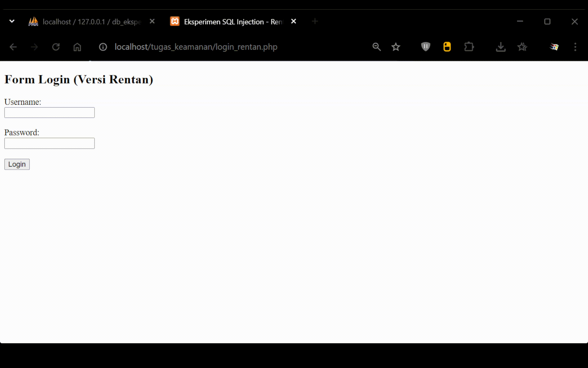
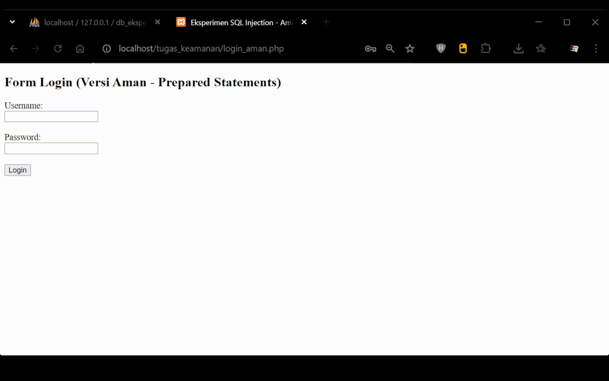

# Hasil-Eksperimen-SQL-Injection

- Nama : Roufan Awaluna Romadhon
- NIM : 31240423
- Kelas : I241C

## Eksperimen Keamanan Web: SQL Injection (Login Bypass)

Repositori ini dibuat untuk memenuhi tugas UTS Pemrograman Web. Proyek ini mendemonstrasikan kerentanan SQL Injection (SQLi) pada fitur login aplikasi berbasis PHP dan cara memperbaikinya menggunakan Prepared Statements.

### Deskripsi Eksperimen

Eksperimen ini mensimulasikan teknik Login Bypass di mana penyerang dapat masuk ke sistem tanpa mengetahui kata sandi yang valid hanya dengan memanipulasi query SQL melalui form input.

### Persiapan

1. Jalankan XAMPP (Apache dan MySQL).
2. Buat database bernama db_eksperimen.
3. Jalankan perintah SQL berikut di phpMyAdmin:

```sql
CREATE TABLE users (
    id INT AUTO_INCREMENT PRIMARY KEY,
    username VARCHAR(50) NOT NULL,
    password VARCHAR(50) NOT NULL
);
INSERT INTO users (username, password) VALUES ('admin', 'rahasia123');
```

4. Letakkan file .php ke dalam folder htdocs/tugas_keamanan/.

### Struktur File

- login_rentan.php: Kode yang memiliki celah keamanan SQL Injection.
- login_aman.php: Kode yang sudah diperbaiki menggunakan Prepared Statements.

### Melakukan Injeksi

Akses login_rentan.php dan menginput data berikut:
- Username: admin' #
- Password: (bebas/sembarang)



Hasilnya Sistem akan memberikan akses masuk karena karakter ' # memanipulasi query SQL untuk mengabaikan pengecekan kata sandi.

### Melakukan Mitigasi

Pencegahan dilakukan dengan mengganti metode penggabungan variabel langsung (string concatenation) menjadi Prepared Statements menggunakan ekstensi mysqli atau PDO di PHP.

```php
$stmt = $koneksi->prepare("SELECT * FROM users WHERE username = ? AND password = ?");
$stmt->bind_param("ss", $username, $password);
$stmt->execute();
```

